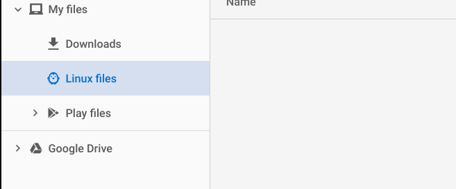
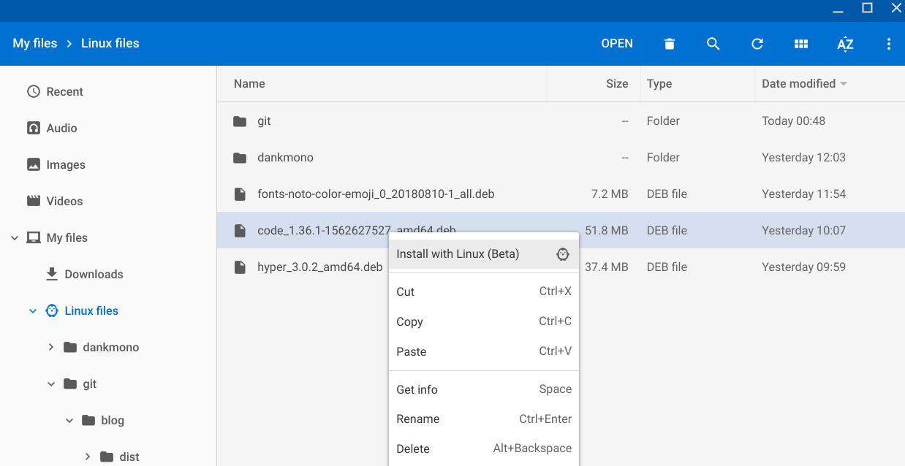
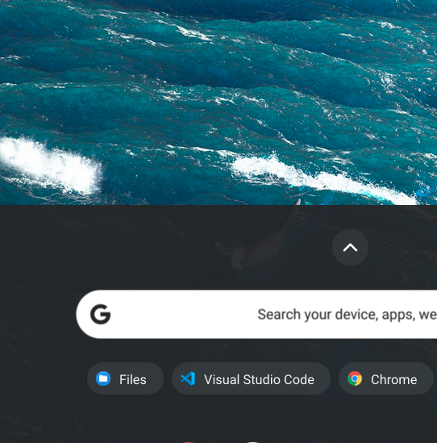
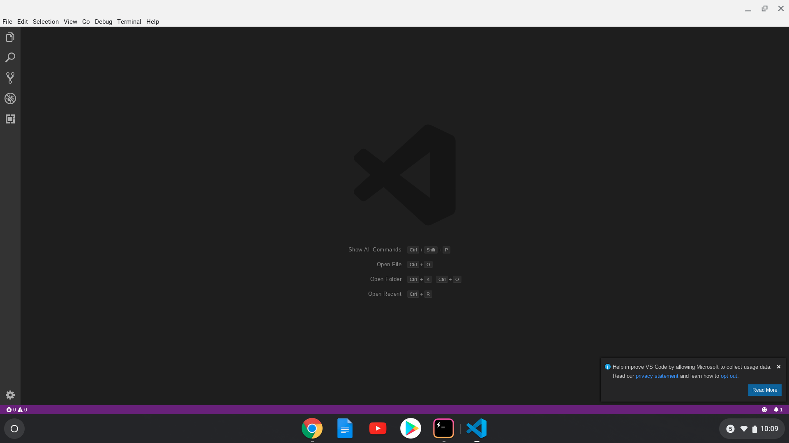

I was browsing around for some computer components when I came across a Chromebook that was marked down. The stats were quite good, and it seemed like (in general) a reasonably sturdy piece of hardware. "Shame it's not a real laptop." I thought to myself. Then I thought more why wasn't a Chromebook a *real* laptop? It seems the only answer was the operating system. Due to some [changes](https://support.google.com/chromebook/answer/9145439?hl=en) to ChromeOS, this is no longer the case.

What follows is a step-by-step guide for how to turn a seemingly simple "internet machine" (Chromebook) into a full-fledged development environment. For brevity, I have included simple instructions on this blog. If you want a more raw, verbose account of what I went through check out the play-by-play [on twitter](https://twitter.com/benblais/status/1157282631047737347).

## The Chromebook

Asus Chromebook Flip.

Stats for this model:
- **CPU :** Intel Core m3-8100Y 1.1GHz (Turbo up to 3.4GHz)
- **RAM :** 8GB LPDDR3 (On Board)
- **GPU :** Intel HD Graphics
- **SSD :** 64GB EMMC
- **WIFI:** 802.11ac, 2x2 (dual-band)
- **BlueTooth:** Bluetooth 4.0
- **Battery:** 48WHrs, 3S1P, 3-cell Li-ion

Usually, this model goes for ~$600, however, this one sale for $300. You can probably get by with a much less expensive model, but I would recommend trying to get as much ram as possible within your budget.

## 0. Setting Up The Chromebook

For this guide, I'm going to gloss over the process of setting up ChromeOS itself and will instead focus exclusively on setting up a development environment. If you need help with this, Google has a [simple guide](https://support.google.com/chromebook/answer/1047362?hl=en) on getting your Chromebook up and running.

I would spend a little bit of time getting familiar with ChromeOS but feel free to jump into the rest of the guide head-first if you happen to be feeling adventurous.

## 1. Turn on ChromeOS Linux feature

If you poked around the Play store, you probably took note of the fact that there are many apps. Unfortunately, we will need some specialized tools that cannot be found there to do our development work. The good news though is, installing these tools is relatively easy and requires only one trip to the settings page.

Under settings, in the advanced section, you will find a section called Linux (beta). Click the "Turn On" button to install it.


Once the install has completed a notification will appear along with this terminal window. Feel free to close it. We will not need a terminal until later in this guide.


Now we are ready to move on to the next part: installing and editor.

## 2. Installing the Editor (VSCode)

VSCode is the text editor of choice for myself, and many other developers let's install that next.

We begin by downloading the .deb version of VSCode from [https://code.visualstudio.com/](https://code.visualstudio.com/). You will want to download the "deb" option.


When prompted for where to save, make sure to select the "Linux Files" section in the explorer.


Once the download has finished, go to its location in the file explorer. Once there you can alt-click it and select the "Install with Linux (Beta)" option, this will install VSCode as a Linux app.


Once the install is complete, you can launch this just like a ChromeOS app.



Next, let's get Node and NPM installed so we can write some JavaScript.

## 3. Installing Node and NPM

Remember how I said we would be using the terminal later in this guide? Go ahead and open the terminal now.

If this is your first time using the command line, don't worry, most of this is copy/paste.

Note: the default terminal on ChromeOS has paste bound to the CTRL+SHIFT+v

First, we need to be able to resolve the NodeJS package. Enter the following command into your terminal
```bash
~$ curl -sL https://deb.nodesource.com/setup_12.x | sudo -E bash -
```

You can replace '12' with whatever is the latest version of NodeJS. (check at [https://nodejs.org](https://nodejs.org)).

This command will output lots of text. Next, install NodeJS
```bash
~$ sudo apt-get install -y nodejs
```

More text will be displayed. Next, make sure NodeJS got installed properly by running it with the version flag.
```bash/1
~$ node -v
v12.7.0
```
The same will work with NPM:
```bash/1
~$ npm -v
6.10.0
```

After running this command, a version will display on the next line. Congrats! You have installed node on your Chromebook.

## 5. Setting up Git

Fortunately, Linux on your Chromebook has git installed already. 
```bash/1
~$ git --version
git version 2.11.0
```

If for some reason it's not there, or you uninstalled it by accident while exploring, no sweat, you can easily reinstall it again.

```bash
~$ sudo apt-get install git
```

## That's it

Congratulations, you have now set up your development environment on a Chromebook. That's it for this guide. If you need help finding a project to get started on I, recommend checking out [create-react-app getting started](https://facebook.github.io/create-react-app/docs/getting-started), [Vuejs's getting started guid](https://vuejs.org/v2/guide/), or any of the other tutorials out there.