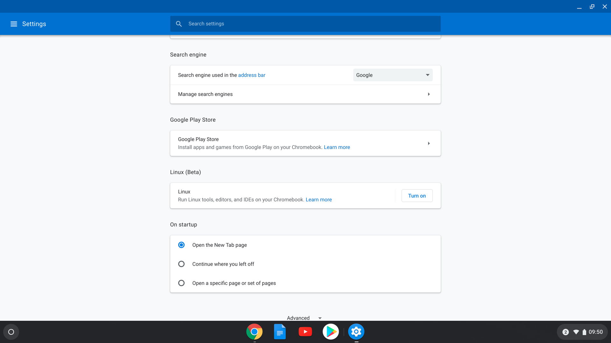
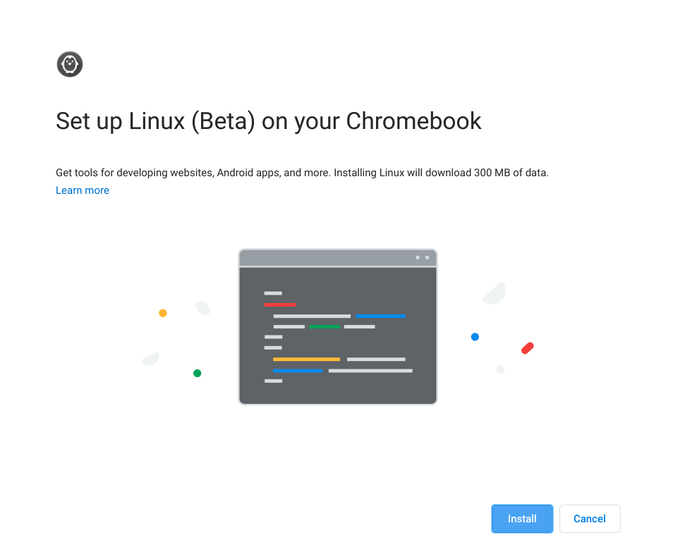
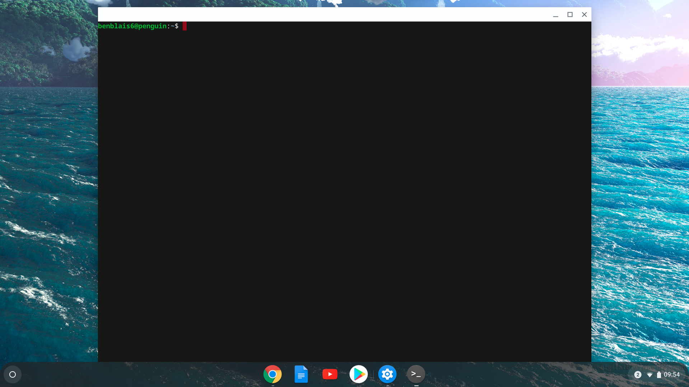
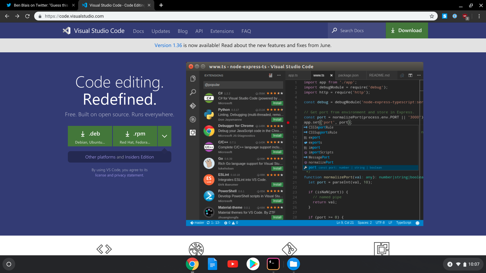

I was browsing around for some computer components when I came across a chromebook that was marked down. The stats were quite good and it seems like (in general) a fairly sturdy piece of hardware. "Shame it's not a real laptop." I thought to myself, then it occurred to me that this *was* an actual laptop it was simply a mater of operating system. Not only that but it was technically a unix based operating system.

What follows is a step-by-step guide for how to turn a seemingly simple "internet machine" into a full fledged development environment. For brevity, I have included simple instructions. If you want a more raw, verbose account of what I went through can find the live play-by-play [on twitter](https://twitter.com/benblais/status/1157282631047737347).

## The Chromebook

Asus Chromebook Flip.

Stats for this model:
- **CPU :** Intel Core m3-8100Y 1.1GHz (Turbo up to 3.4GHz)
- **RAM :** 8GB LPDDR3 (On Board)
- **GPU :** Intel HD Graphics
- **SSD :** 64GB EMMC
- **WIFI:** 802.11ac, 2x2 (dual-band)
- **BlueTooth:** Bluetooth 4.0
- **Battery:** 48WHrs, 3S1P, 3-cell Li-ion

Normally this model goes for ~$600, mine was one sale for $300. You can probably get by with a much less expensive model, but I would recommend trying to get as much ram as possible within your budget.

## 0. Setting Up The ChromeBook

For this guide, I'm going to gloss over setting up ChromeOS itself and will focus exclusively on what is required for setting up a development environment. If you need help with this Google has a [simple guide](https://support.google.com/chromebook/answer/1047362?hl=en) on how to setup a new chromebook.

I would spend a little bit of time getting familiar with ChromeOS but feel free to jump into the rest of the guide head-first if it suites you.

## 1. Turn ChromeOS linux feature

If you poked around the Play store, you probably took note of the fact that there are a lot of apps, unfortunately we will need some specialized tools that cannot be found there to do our development work. The good news though is, installing these tools is fairly easy and requires only one trip to the settings page.

Under settings, in the advanced section, you will find a section called linux (beta). Click the "Turn On" button to install it.

Once the install is completed a notification will appear along with this terminal window. Feel free to close it. We will not be needing a terminal until later in this guide.

Now we are ready to move on to the next part: installing and editor.

## 2. Installing the Editor (VSCode)

VSCode is the text editor of choice for myself and many other developers lets install that next.

We begin by downloading the .deb version of VSCode from [https://code.visualstudio.com/](https://code.visualstudio.com/).
